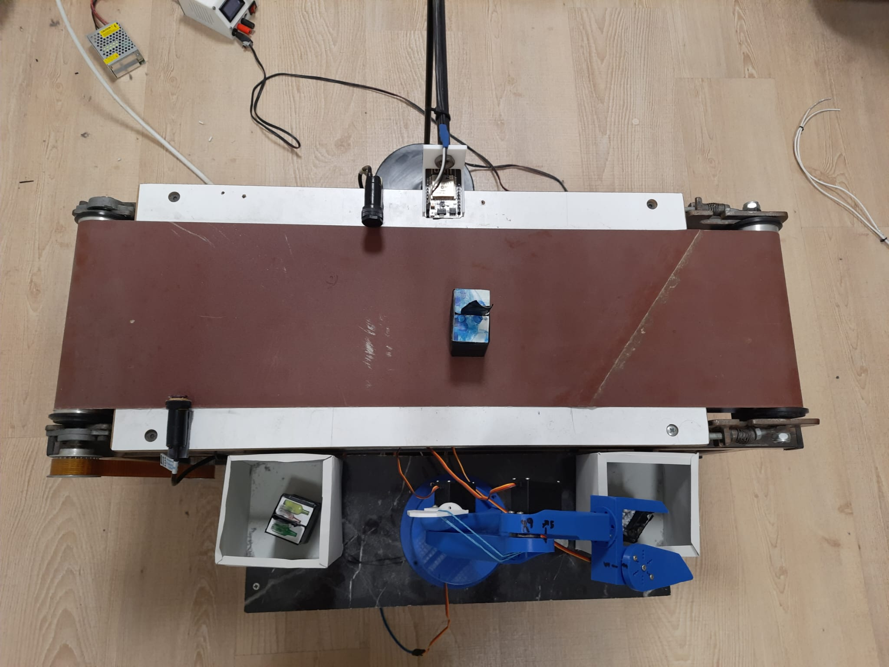

# Akıllı Konveyör ve Robotik Kol Sistemi

Bu proje, Elektrik-Elektronik Mühendisliği bitirme projesi kapsamında
3 kişilik bir grup tarafından geliştirilmiştir.

Projeye hazır bir konveyör bant kiti ile başlanmış, sistem için özel bir
robotik kol tasarlanmış ve 3D yazıcı ile üretilmiştir. Sistem; STM32
Blackpill, ESP32-CAM ve NodeMCU WiFi modülü kullanılarak kontrol edilmektedir.

## Sistem Genel Görünümü
Aşağıdaki fotoğrafta sistemin tam montajlı ve çalışır haldeki görünümü yer almaktadır.

## Kullanılan Donanımlar
- STM32 F411CCU6 (Blackpill)
- ESP32-CAM
- NodeMCU WiFi Modülü
- 2 adet IR sensör
- OLED ekran
- İzoleli röle ve optokuplörler

## Dokümanlar ve Medya
- 📄 Bitirme Sunumu (PDF)
- 📄 KiCad Şematik (PDF)
- 🎥 Çalışan sistem videosu (YouTube Short)

Tüm ilgili dosyalar repo içerisinde klasörlenmiş şekilde bulunmaktadır.

## Video
Sistemin çalışır halini gösteren kısa video:
[YouTube Short Linki](https://www.youtube.com/shorts/qmrU1mQj9-M?feature=share)

## Sistem Çalışma Prensibi

Bu bitirme projesi, kamera destekli görüntü işleme kullanarak konveyör bant
üzerinde ilerleyen kutuları **metal, plastik ve cam** olarak otomatik şekilde
sınıflandıran ve ayıran bir sistemdir.

Konveyör bant üzerinde ilerleyen kutular, **ESP32-CAM** tarafından
görüntülenir. Alınan görüntüler WiFi üzerinden bilgisayarda çalışan
**Python tabanlı bir sunucuya** gönderilir. Görüntü işleme işlemleri,
**Flask framework’ü** kullanılarak oluşturulan bu sunucu üzerinde
gerçekleştirilir.

Görüntü işleme aşamasında, **YOLOv8 OBB (Oriented Bounding Box)** modeli ile
eğitilmiş olan `best.pt` ağırlıkları kullanılarak kutuların hem **malzeme
türü (metal, plastik, cam)** hem de **konum bilgileri** tespit edilir.
Bu sayede kutunun hangi sınıfa ait olduğu ve robot kolun ulaşması gereken
hedef nokta belirlenmiş olur.

Elde edilen sınıflandırma ve konum bilgileri, WiFi üzerinden
**NodeMCU (ESP8266)** modülü aracılığıyla **STM32 F411 Blackpill**
mikrodenetleyicisine iletilir. STM32, gelen konum bilgilerine göre
**ters kinematik (inverse kinematics)** ve **doğrusallaştırma fonksiyonları**
kullanarak robotik kolun eklem açılarını hesaplar ve kolu hedef noktaya
otomatik olarak yönlendirir.

Konveyör bant üzerindeki kutuların doğru konumda durdurulabilmesi için
**IR sensörler** kullanılmıştır. Kutu algılandığında, **izoleli röle**
yardımıyla konveyör bant durdurulur, robotik kol ayırma işlemini gerçekleştirir
ve işlem tamamlandıktan sonra bant tekrar çalıştırılır.

Bu yapı sayesinde sistem, minimum insan müdahalesi ile geri dönüşüm
malzemelerini otomatik olarak algılayıp ayrıştırabilmektedir.

# Smart Conveyor and Robotic Arm System

This project was developed as an Electrical and Electronics Engineering
senior design project by a team of three students.

The system is based on a conveyor belt kit and a custom-designed robotic
arm manufactured using a 3D printer. Control and communication are handled
using an STM32 Blackpill, ESP32-CAM, and NodeMCU WiFi module.

## System Overview
The image below shows the fully assembled and operational system.

## Documentation and Media
- 📄 Graduation project presentation (PDF)
- 📄 KiCad schematic (PDF)
- 🎥 Working system video (YouTube Short)

## Video
Short demonstration video of the working system:
[YouTube Short Link](https://www.youtube.com/shorts/qmrU1mQj9-M?feature=share)

## System Working Principle

This project is an automated sorting system that uses camera-based
image processing to classify and separate boxes on a conveyor belt
as **metal, plastic, or glass**.

Boxes moving on the conveyor belt are captured by an **ESP32-CAM** module.
The captured images are transmitted via WiFi to a
**Python-based server running on a computer**. Image processing operations
are performed on this server using the **Flask framework**.

During the image processing stage, a **YOLOv8 OBB (Oriented Bounding Box)**
model trained with `best.pt` weights is used to detect both the
**material type (metal, plastic, glass)** and the **position** of each box.
This allows the system to determine the target location for the robotic arm.

The extracted classification and position data are sent via WiFi to the
**STM32 F411 Blackpill** microcontroller using a **NodeMCU (ESP8266)** module.
Based on the received position data, the STM32 calculates the required joint
angles using **inverse kinematics** and **linearization functions**, and
automatically guides the robotic arm to the correct sorting location.

**IR sensors** are used to stop the boxes at the desired position on the
conveyor belt. When a box is detected, the conveyor belt is stopped using
an **isolated relay**, the robotic arm performs the sorting operation, and
the belt resumes operation after the process is completed.

With this structure, the system is capable of automatically detecting and
sorting recyclable materials with minimal human intervention.

